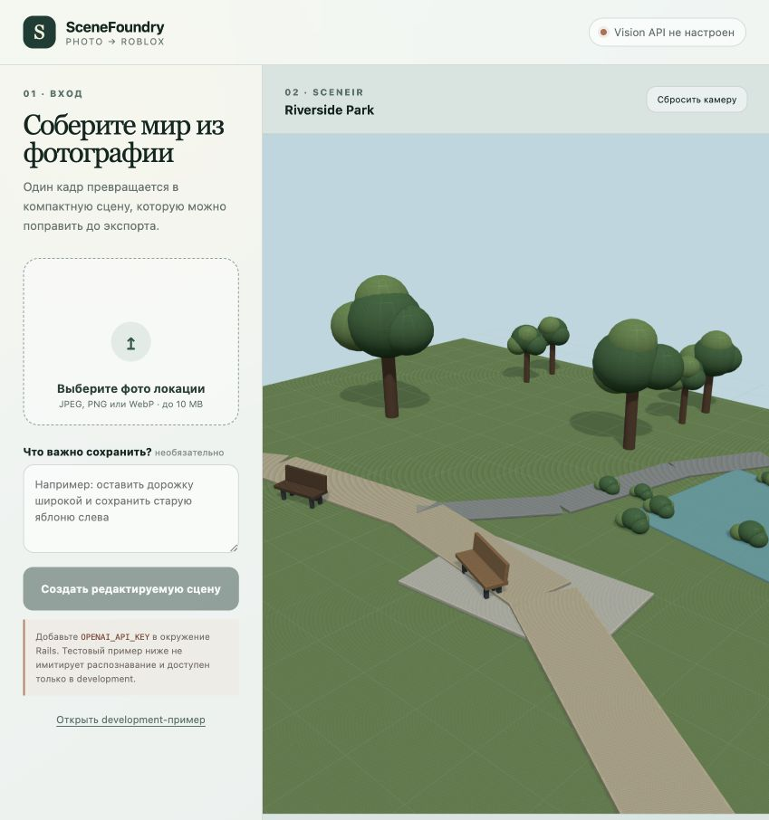

# SceneFoundry — Photo to Editable Roblox Map

SceneFoundry is an end-to-end prototype that turns a photograph of a real location into an editable Roblox place:

`photo → OpenAI Vision → SceneSpec JSON → deterministic compiler → SceneIR → Three.js preview / .rbxlx`

The production workflow does not require a user to write JSON or custom code for each photograph. The vision model creates a compact, structured scene description; trusted application code validates it, builds the geometry, renders the preview, and exports a real Roblox XML place file.

## Visual Example

### Real-world reference photograph


### Editable scene preview



The second image is the checked-in development fixture rendered by the running application. It demonstrates the editable SceneIR, Three.js preview, metrics, and export workflow; it is not presented as a live inference result for the photograph above. Add `OPENAI_API_KEY` and upload a new image to exercise the complete vision path.

## What Works

- JPEG, PNG, and WebP uploads up to 10 MB.
- Image analysis through the OpenAI Responses API using a Base64 data URL.
- Strict structured output using the versioned `SceneSpec 1.0` schema.
- Surfaces, polyline paths, objects, repeated object groups, spawn position, camera, and source assumptions.
- Server-side validation of numeric ranges, semantic IDs, references, spawn safety, and scene budgets with precise JSON error paths.
- Deterministic compilation: the same `SceneSpec + seed + component_version` produces the same geometry.
- A shared `SceneIR` consumed by both the interactive Three.js preview and the Roblox exporter.
- A genuine `.rbxlx` XML place containing editable `Model`, `Part`, and `SpawnLocation` instances, plus camera and lighting configuration.
- Per-order timing, token usage, estimated API cost, and an `order_id` in the API response.
- Structured `scene_order_completed` events in the Rails log.
- Safe geometry generation without model-produced executable code, Roblox scripts, or untrusted external asset IDs.

## Architecture

| Layer | Responsibility |
| --- | --- |
| React + TypeScript | Upload workflow, SceneSpec editor, metrics, Three.js preview, and `.rbxlx` download |
| Rails API | File validation, orchestration, compilation, export, and error handling |
| OpenAI Vision | Converts a new photograph into strict `SceneSpec 1.0` structured output |
| `Scene::Validator` | Enforces semantic, geometric, reference, spawn, and budget constraints |
| `Scene::Compiler` | Expands registered components into deterministic, portable `SceneIR` |
| `Roblox::Exporter` | Serializes the same `SceneIR` into an editable Roblox XML place |

The coordinate system is fixed to `Y up` and `-Z forward`, with dimensions expressed in Roblox studs. Inferred content outside the photograph is recorded in `source.assumptions`, while `source.scale_confidence` communicates scale uncertainty.

### Processing flow

1. `POST /api/v1/scenes/analyze` validates the uploaded image and sends it to the vision model.
2. The model must return data matching `config/schema/scene_spec.schema.json`.
3. `Scene::Validator` applies the constraints that are intentionally kept outside the Structured Outputs-compatible schema.
4. `Scene::Compiler` expands only registered components: `tree`, `bush`, `rock`, `bench`, `fence`, and `building`.
5. A semantic object's seed is derived from the global seed, semantic ID, and component-library version, so editing one object does not reshuffle unrelated geometry.
6. React/Three.js renders the resulting `SceneIR`.
7. `Roblox::Exporter` converts that same `SceneIR` into `.rbxlx`, grouping parts by semantic ID.

## Quick Start

Requirements:

- Ruby 3.3.4
- Bundler
- Node.js 22 or newer
- npm

```bash
cp .env.example .env
# Add OPENAI_API_KEY to .env
bin/setup --skip-server
bin/dev
```

Open [http://127.0.0.1:5173](http://127.0.0.1:5173). `bin/dev` starts Rails on port `3000`, Vite on port `5173`, and loads the local `.env` file. Existing environment variables take precedence.

Without an API key, the UI blocks photograph analysis and explains why. The development example remains available only in `development` and `test`; it is never reported as a vision result.

## API

| Method | Endpoint | Purpose |
| --- | --- | --- |
| `GET` | `/api/v1/status` | Vision readiness, selected model, and component version |
| `GET` | `/api/v1/scenes/schema` | Structured-generation JSON Schema |
| `POST` | `/api/v1/scenes/analyze` | Multipart `photo` and optional `hint` → SceneSpec, SceneIR, and metrics |
| `POST` | `/api/v1/scenes/compile` | Edited `scene_spec` → SceneIR |
| `POST` | `/api/v1/scenes/export` | Edited `scene_spec` → `.rbxlx` |

A successful analysis includes operational metrics:

```json
{
  "metrics": {
    "order_id": "request-id",
    "vision_model": "gpt-5.6-terra",
    "vision_ms": 0,
    "compile_ms": 0,
    "total_ms": 0,
    "input_tokens": 0,
    "cached_input_tokens": 0,
    "output_tokens": 0,
    "api_cost_usd": 0
  }
}
```

Estimated cost is calculated from the response's actual token usage. Pricing entries in `Vision::SceneAnalyzer` were last checked on 2026-09-10. An unknown model returns `null` for cost rather than inventing an estimate.

## Determinism and Safety

- Default limits are 1,500 parts and 120,000 estimated triangles.
- Repeated-group expansion is checked before geometry is produced.
- Semantic IDs must be unique, and surface/path references must resolve.
- Spawn locations are rejected when they intersect water or buildings.
- The model produces data, not executable source code.
- The compiler uses a fixed component registry and the exporter emits no Roblox scripts.
- Local secrets such as `.env`, `config/master.key`, and API keys are excluded from Git.

## Verification

```bash
bin/verify
bundle exec rails scenes:generate
```

`bin/verify` runs the Rails test suite, TypeScript type checking, the Vite production build, and `git diff --check`. The scene generator writes three development fixtures to `generated_maps/` and records actual local processing time and file sizes in `generated_maps/generation_metrics.json`.

Latest verified baseline:

- Rails: 15 tests, 68 assertions, 0 failures.
- Frontend: TypeScript type check and Vite production build pass.
- Browser workflow: the scene renders in WebGL; changing repeat count reduces the map from 105 to 77 parts; the export endpoint returns `.rbxlx`.
- Roblox export: XML parses successfully, the part count matches SceneIR, exactly one `SpawnLocation` exists, and no scripts are present.
- Fixture generation: coast — 70 parts / 108.52 ms; courtyard — 110 parts / 121.55 ms; park — 105 parts / 129.51 ms.

A live vision request was not run in the committed environment because `OPENAI_API_KEY` is intentionally absent. The Responses API contract is covered by a fake-transport test, while the multipart upload → analyzer → validator → compiler path is covered by an integration test.

## Current Limitations

- A single photograph cannot reveal true depth or hidden geometry. SceneFoundry preserves the recognizable composition and records assumptions, but it does not claim photogrammetric accuracy.
- This first milestone builds geometry from Roblox primitives. `MeshPart`, terrain voxels, textures, multiplayer support, and persistent jobs are intentionally deferred.
- API cost is an estimate derived from token usage, not a billing receipt.

## Key Files

- `config/schema/scene_spec.schema.json` — structured-output contract.
- `app/services/vision/scene_analyzer.rb` — vision request and usage metrics.
- `app/services/scene/validator.rb` — semantic and budget validation.
- `app/services/scene/compiler.rb` — deterministic scene compilation.
- `app/services/scene/component_registry.rb` — trusted component library.
- `app/services/roblox/exporter.rb` — `.rbxlx` export.
- `frontend/src/App.tsx` — upload, editing, metrics, and export workflow.
- `frontend/src/SceneViewer.tsx` — interactive Three.js scene preview.
