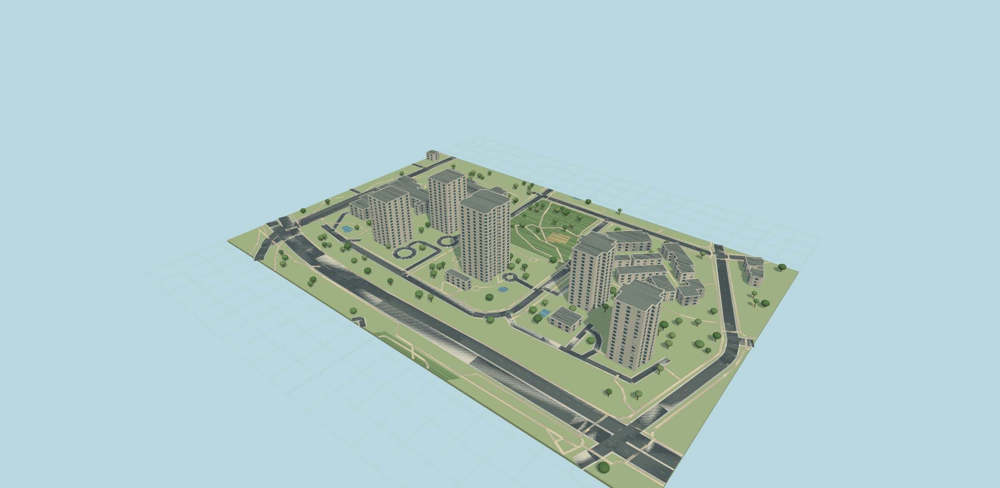
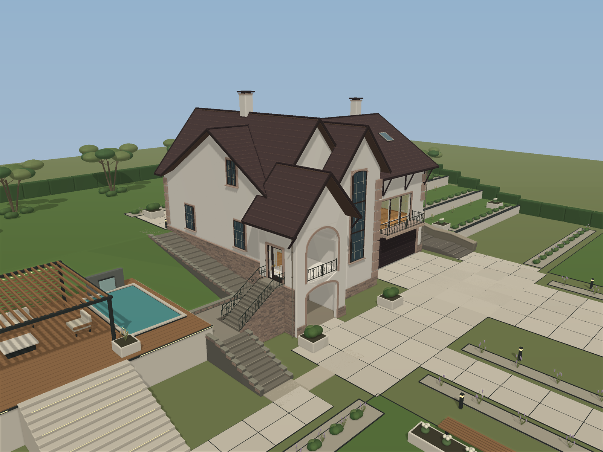
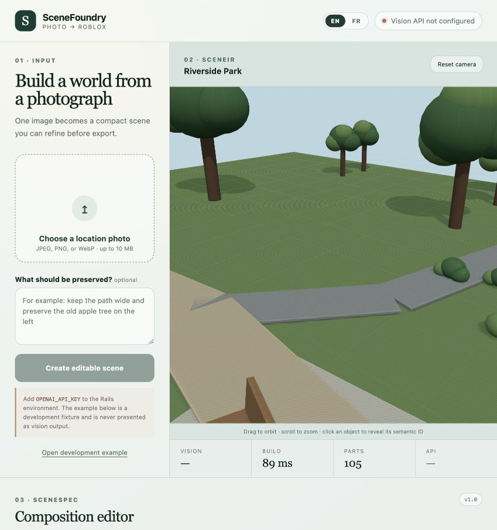

# SceneFoundry — Photo to Editable Roblox Map

SceneFoundry is a manual-first service for turning photographs of real locations into editable Roblox places, with a separate admin-only AI Lab for experiments.

The customer-facing beta uses a reservation-first offer: creating the request is free, Stripe places a $19 authorization hold, and an operator either approves the photos and captures it or rejects the request and releases the hold. Approved maps are built manually, uploaded by the operator, and remain private until final delivery.

The separate AI Lab keeps the automated pipeline available for internal experiments:

`photo → OpenAI Vision → SceneSpec JSON → deterministic compiler → SceneIR → Three.js preview / .rbxlx`

The production workflow does not require a user to write JSON or custom code for each photograph. The vision model creates a compact, structured scene description; trusted application code validates it, builds the geometry, renders the preview, and exports a real Roblox XML place file.

## Production readiness review

The current release adds an [open-data neighbourhood case](docs/case-study-springer-park.md) and a refreshed [seven-step launch checklist](docs/launch-checklist-2026-09-20.md). The September 16 review below is historical; its code has since reached the Render release branch.

The September 16 review fixes verified admin access, account recovery, frontend request handling, Vision retries, checkout navigation, stale payment events, and vulnerable Ruby dependencies. It adds CI and defers the 3D bundle until a preview is opened. See [the detailed production checklist](docs/production-readiness-2026-09-16.md) for deployment blockers, acceptance criteria, verification evidence, and commit history.

Current local verification (September 20): **86 Rails tests / 515 assertions**, **15 frontend/API and case-asset tests**, TypeScript and production build passing. The September 16 dependency audits had no known advisory matches; CI repeats the audits on every push. These checks do not replace staging tests of Stripe, mail, S3, the production Ruby runtime, or real Roblox Studio output. Existing admin accounts need verified Google sign-in or an emailed password reset after the new migration.

## Visual Gallery

### Springer Park — open-data neighbourhood study

[Explore the public case](https://scenefoundry-roblox.onrender.com/?case=springer-park) · [60-second captioned walkthrough](frontend/public/cases/springer-park/SceneFoundry_Case_Walkthrough.mp4) · [Editable Roblox place](frontend/public/cases/springer-park/Springer_Park_Open_Data.rbxlx)



Map data © [OpenStreetMap contributors](https://www.openstreetmap.org/copyright), ODbL 1.0. This independent open-data rebuild has 20 building footprints and 5,682 parts; its original procedural facades do not use Google imagery. It demonstrates an operator-built vector-to-Roblox workflow, not a delivered customer order or a live AI result. The downloadable source/derived databases, limitations and Studio QA still required are documented in [the case methods](docs/case-study-springer-park.md).

### End-to-end order demo

[Watch the 32-second SceneFoundry workflow demo](docs/demo/SceneFoundry_Workflow_Demo.mp4). It uses the supplied Pacific Centre photograph and finished Roblox result to show the actual sign-in, recovery, operator review, customer delivery, and email-preview surfaces.

### House and landscaped grounds



This representative environment was created during prototype development and demonstrates the level of composition the project is designed to preserve: the building footprint, surrounding paths, vegetation, elevation changes, and pool remain individually editable.

### Park scene in the English interface



The park is the checked-in development fixture rendered by the running application. It demonstrates the localized editor, editable SceneIR, Three.js preview, metrics, and export workflow. It is not presented as a live vision inference result. Add `OPENAI_API_KEY` and upload a new image to exercise the complete vision path.

## What Works

- A single, clear sign-in entry point: Google is the only social provider, while email/password remains available as a fallback.
- Email/password registration with bcrypt password hashing, encrypted HttpOnly cookie sessions, and expiring password-reset links.
- Private customer accounts with a persistent order history.
- Requests containing one to three private source photos, a scene/style brief, and a recorded image-rights confirmation.
- A manual admin Orders workspace with filters for Pending review, In progress, Completed, and Failed; source downloads; private notes; replacement artifacts; an interactive QA preview; and explicit approve/start, reject, and complete/deliver actions.
- Automatic extraction of safe browser-preview geometry from the operator's `.rbxlx`; no second JSON upload is required.
- A $19 Stripe Checkout authorization using manual capture: placing a hold does not charge the customer, acceptance captures once, and decline/cancel releases an uncaptured authorization.
- Persisted Stripe-event deduplication, row-locked transitions, amount/currency/customer validation, and idempotency keys protect against duplicate capture and replayed webhooks.
- Customer orders never invoke Astra automatically. The operator builds each accepted map manually and uploads the finished `.rbxlx`; the AI Lab remains isolated for admin experiments.
- Customer progress for every order and payment state; interactive preview and `.rbxlx` download become visible only after approval.
- An admin email containing the customer's identity, complete brief, rights confirmation, payment state, due date, and protected source-photo links whenever a new order is created.
- In-app notifications and email when the preview or paid download becomes ready.
- Admin-only previews of the exact new-order, password-reset, preview-ready, and map-ready email templates before SMTP is enabled.
- JPEG, PNG, and WebP uploads up to 10 MB.
- A fully localized interface in English and French, with English as the default and the selected language saved in the browser.
- Image analysis through the OpenAI Responses API using a Base64 data URL.
- Two quality profiles: the default two-pass Terra analysis (`high` spatial draft + `medium` composition review), and an explicitly enabled Astra Max profile (`gpt-6-astra` `max` draft + `high` review).
- Strict structured output using the versioned `SceneSpec 1.1` schema.
- Rectangular, elliptical, and arbitrary polygon surfaces; straight or curved bordered paths; semantic objects; repeated groups; procedural composition patterns; spawn position; camera; and source assumptions.
- Reusable procedural patterns for formal gardens, terraces, mountain ridges, and forest framing. These are selected only when the photograph contains that scene structure.
- A generic solid-mass fallback keeps unfamiliar but important objects in the composition instead of silently dropping them.
- Server-side validation of numeric ranges, semantic IDs, references, spawn safety, and scene budgets with precise JSON error paths.
- Automatic proportional normalization of oversized vision geometry and repeated groups before validation, preserving the scene layout while keeping exports within safe limits.
- Deterministic compilation: the same `SceneSpec + seed + component_version` produces the same geometry.
- A shared `SceneIR` consumed by both the interactive Three.js preview and the Roblox exporter.
- A genuine `.rbxlx` XML place containing editable `Model`, `Part`, and `SpawnLocation` instances, plus camera and lighting configuration.
- An opt-in ready-map response: requests with `include_map=true` receive the compiled `.rbxlx` as a checksummed Base64 `roblox_file`, so the browser can download it without a second export request.
- Per-order timing, token usage, estimated API cost, and an `order_id` in the API response.
- Structured `scene_order_completed` events in the Rails log.
- Safe geometry generation without model-produced executable code, Roblox scripts, or untrusted external asset IDs.
- The operator queue, email-template previews, and AI Lab are hidden from customers and enforced as admin-only on the server.

## Architecture

| Layer | Responsibility |
| --- | --- |
| React + TypeScript | Customer accounts, manual-order progress, operator controls, admin-only AI Lab, Three.js preview, and `.rbxlx` download |
| Rails API + PostgreSQL | Authentication, private orders, guarded state transitions, Stripe event ledger, generation metrics, notifications, validation, orchestration, compilation, and export |
| Active Storage + Action Mailer | Private local order artifacts (S3-ready) and preview/download-ready email delivery |
| Stripe Checkout + signed webhook | Hosted manual-capture authorization, authoritative capture/release/refund state, and replay-safe reconciliation |
| Active Job | Transactional background work and an isolated experimental generation runner that is never started by customer orders |
| OpenAI Vision | Creates a strict `SceneSpec 1.1` draft and reviews its visual composition using the request-selected Terra or Astra Max profile |
| Geometry and budget normalizers | Scale oversized scenes uniformly and reduce only repeated groups when required |
| `Scene::Validator` | Enforces semantic, geometric, reference, spawn, and budget constraints |
| `Scene::Compiler` | Expands registered components into deterministic, portable `SceneIR` |
| `Roblox::Exporter` | Serializes the same `SceneIR` into an editable Roblox XML place |

The coordinate system is fixed to `Y up` and `-Z forward`, with dimensions expressed in Roblox studs. Inferred content outside the photograph is recorded in `source.assumptions`, while `source.scale_confidence` communicates scale uncertainty.

### Processing flow

1. `POST /api/v1/scenes/analyze` validates the uploaded image and selects the requested quality profile. Terra remains the default; `quality_mode=astra_max` is available only when `ASTRA_QUALITY_ENABLED=true`.
2. The selected model identifies the scene family, camera, depth layers, major footprints, paths, terrain, and composition anchors as strict `SceneSpec 1.1` data. The Astra Max profile uses `gpt-6-astra` with `max` reasoning for this draft.
3. A second pass audits the draft against the same photograph and corrects material composition gaps. Terra uses `medium` reasoning; Astra Max uses `high` reasoning.
4. Geometry and budget normalizers uniformly scale unsupported dimensions and reduce procedural density when required.
5. `Scene::Validator` applies the constraints intentionally kept outside the Structured Outputs-compatible schema.
6. `Scene::Compiler` expands registered semantic components, generic masses, arbitrary contours, curved paths, and matching procedural patterns into deterministic geometry.
7. A semantic object's seed is derived from the global seed, semantic ID, and component-library version, so editing one object does not reshuffle unrelated geometry.
8. React/Three.js renders the resulting `SceneIR`.
9. `Roblox::Exporter` converts that same `SceneIR` into `.rbxlx`, grouping parts by semantic ID. With `include_map=true`, the API includes this ready file in the response as `roblox_file`.

The model still returns structured scene data internally; it does not write executable code or arbitrary Roblox XML. The trusted Ruby compiler and exporter create the final map immediately in the same request, which keeps the `.rbxlx` valid, deterministic, and safe to edit.

No coordinates or rules are tied to a particular photograph. A garden can use `formal_garden`, while a house, street, coast, or unknown scene is assembled from the same reusable surfaces, paths, buildings, masses, elevation patterns, and distributions.

## Quick Start

Requirements:

- Ruby 3.3.4
- Bundler
- Node.js 22 or newer
- npm
- PostgreSQL 16 or newer

```bash
cp .env.example .env
# Add OPENAI_API_KEY to .env
# Set ADMIN_EMAILS to the account that will fulfill orders
# Add Stripe test keys and Google OAuth credentials when testing those integrations
# Defaults: Terra high draft + Terra medium refinement
# Optional premium profile, after configuring authentication, quotas, and spend limits:
# ASTRA_QUALITY_ENABLED=true
# Customer orders remain manual even when the admin-only AI Lab is enabled
bin/setup --skip-server
bin/dev
```

Open [http://127.0.0.1:5173](http://127.0.0.1:5173). `bin/dev` starts Rails on port `3000`, Vite on port `5173`, and loads the local `.env` file. Existing environment variables take precedence.

Without an API key, the UI blocks photograph analysis and explains why. The development example remains available only in `development` and `test`; it is never reported as a vision result.

Customer orders do not need an OpenAI key. The key and Astra flags are used only by the admin-only AI Lab. PostgreSQL is required. In development, notification emails are written to `tmp/mails` unless SMTP variables are supplied. Every address in `ADMIN_EMAILS` receives the full new-order notification; an account with one of those addresses gains admin access only after verified Google sign-in or a successful password reset sent to that mailbox. Existing accounts must complete one of these verification flows after upgrading; the migration does not trust previously entered email addresses. First-time Google verification removes any unverified password and revokes old sessions to prevent account pre-registration attacks.

### Render preview deployment

The checked-in `render.yaml` deploys the React build and Rails API as one free
Render web service with a free PostgreSQL database. Render prompts for
`OPENAI_API_KEY`; the value is stored only in Render and is never committed.
The preview URL is `https://scenefoundry-roblox.onrender.com`.

This free deployment is intended for validation, not paid production use.
Render's free PostgreSQL database expires after 30 days, the web service sleeps
after inactivity, and its local filesystem is ephemeral. Before accepting real
orders, move Active Storage to private S3-compatible storage, use a durable
database plan, configure a mail provider that supports HTTPS delivery, and add
Stripe production credentials and a signed webhook.

### Google sign-in

Create a Google OAuth web application, then put its client ID and secret in `.env`. The Google button stays visible but disabled with “Setup required” until both values are present. Use this callback URL for the default local setup:

- Google: `http://127.0.0.1:3000/api/v1/auth/oauth/google/callback`

Set `APP_URL` to the browser-facing origin and `API_URL` to the Rails origin. A verified Google email is required before an identity is linked to an existing account. Email/password sign-in remains available so customers can recover access when Google is unavailable or their account was created by email.

### SMTP and email templates

In development, Action Mailer writes messages to `tmp/mails` when SMTP is not configured. To send real mail, set `MAIL_FROM`, `SMTP_ADDRESS`, `SMTP_PORT`, `SMTP_DOMAIN`, `SMTP_USERNAME`, `SMTP_PASSWORD`, `SMTP_AUTHENTICATION`, and `SMTP_ENABLE_STARTTLS_AUTO` in `.env` or the deployment environment.

An authenticated admin can inspect the exact rendered templates from **Orders** without sending mail. The available previews are new order, password reset, preview ready, and map ready. Production SMTP intentionally remains disabled until valid provider credentials are supplied; no email password is committed to Git.

### Payments and private files

Set `STRIPE_SECRET_KEY` to a Stripe test-mode secret. For local webhook testing, install the Stripe CLI and run:

```bash
stripe listen --forward-to 127.0.0.1:3000/api/v1/payments/stripe/webhook
```

Copy the emitted `whsec_…` value to `STRIPE_WEBHOOK_SECRET`, then restart `bin/dev`. Checkout creates an uncaptured PaymentIntent. A matching signed webhook confirms the authorization; approving the source photos captures it and moves the order into manual production. Rejection or customer cancellation releases the hold. Use Stripe test mode until the complete flow has been exercised.

The production order path is:

`upload → admin email + Pending review → authorize $19 hold → operator approves photos/captures → In progress → manual build and upload → Completed + customer delivery`

The detailed payment and order states remain persisted for Stripe safety, while the admin UI groups them into four operational states. `ASTRA_ORDER_AUTOMATION_ENABLED` is retained only for explicit developer experiments and is not connected to customer-order transitions. See [`docs/order_workflow_contract.md`](docs/order_workflow_contract.md) for the complete state and endpoint contract.

PostgreSQL stores relational data and the compact preview SceneIR. Active Storage stores source photos, optional preview images, and `.rbxlx` files under private local `storage/` during development. Set `ACTIVE_STORAGE_SERVICE=amazon` plus the AWS/S3 variables in `.env` to move binaries to private S3 later without changing the order model.

The interface opens in English. Use the `EN` / `FR` control in the header to switch languages; the choice persists across browser sessions. Localization is implemented with `i18next` and `react-i18next`, and the document language is updated for assistive technologies.

## API

| Method | Endpoint | Purpose |
| --- | --- | --- |
| `GET` | `/api/v1/status` | Vision readiness, selected model, and component version |
| `GET` | `/api/v1/auth/session` | Current account, CSRF token, and enabled OAuth providers |
| `POST` | `/api/v1/auth/register` | Create an email/password account |
| `POST` | `/api/v1/auth/login` | Start an encrypted browser session |
| `POST` | `/api/v1/auth/oauth/google` | Start Google OAuth |
| `POST` | `/api/v1/auth/password/forgot` | Send an enumeration-safe password-reset email |
| `PATCH` | `/api/v1/auth/password/reset` | Replace the password with a valid 30-minute token |
| `GET, POST` | `/api/v1/orders` | List private orders or create a request awaiting payment authorization |
| `POST` | `/api/v1/orders/:public_id/authorize_payment` | Create or reuse a hosted $19 manual-capture Stripe Checkout session |
| `POST` | `/api/v1/orders/:public_id/cancel` | Cancel before capture and release/expire the authorization |
| `POST` | `/api/v1/admin/orders/:public_id/accept` | Approve photos, capture an authorized order exactly once, and begin manual production |
| `POST` | `/api/v1/admin/orders/:public_id/decline` | Reject photos before capture and release the hold |
| `POST` | `/api/v1/admin/orders/:public_id/approve` | Mark a reviewed paid result completed and publish it to the customer |
| `POST` | `/api/v1/payments/stripe/webhook` | Verify and deduplicate authorization, capture, release, failure, and refund events |
| `GET` | `/api/v1/notifications` | List in-app order notifications |
| `GET, PATCH` | `/api/v1/admin/orders` | Operate the manual fulfillment queue |
| `GET` | `/api/v1/admin/email_previews/:template` | Preview a transactional email as an admin |
| `GET` | `/api/v1/scenes/schema` | Structured-generation JSON Schema |
| `POST` | `/api/v1/scenes/analyze` | Multipart `photo`, optional `hint`, `quality_mode`, and `include_map` → SceneSpec, SceneIR, metrics, and optionally a ready map |
| `POST` | `/api/v1/scenes/compile` | Edited `scene_spec`, with optional `include_map` → SceneIR and optionally a ready map |
| `POST` | `/api/v1/scenes/export` | Edited `scene_spec` → `.rbxlx` |

Terra is the default quality mode and requires no request parameter. Astra Max is deliberately opt-in because it can be materially slower and more expensive: set `ASTRA_QUALITY_ENABLED=true`, then send `quality_mode=astra_max`. The profile is fixed to a `gpt-6-astra` `max` draft followed by a `high`-reasoning review; clients cannot override those efforts per request.

The frontend asks for `include_map=true` during analysis and recompilation. That makes the response self-contained: the map is compiled by `Scene::Compiler` and `Roblox::Exporter`, then returned as:

```json
{
  "scene_spec": {},
  "scene_ir": {},
  "roblox_file": {
    "filename": "coastal-garden.rbxlx",
    "media_type": "application/xml",
    "encoding": "base64",
    "data": "PHJvYmxveC4uLg==",
    "byte_size": 123456,
    "sha256": "...",
    "spec_digest": "..."
  },
  "metrics": {
    "map_ready": true,
    "export_ms": 0,
    "rbxlx_bytes": 123456
  }
}
```

Without `include_map=true`, analysis, compilation, and development-example responses remain lean and backward-compatible: they return `scene_spec`, `scene_ir`, and metrics with `map_ready: false`, but omit `roblox_file`. The existing streaming `/export` endpoint also remains available.

Base64 is practical for this local prototype and lets the browser download the exact artifact already built by the server. For production, upload the `.rbxlx` to private object storage and return a short-lived signed URL instead; that avoids Base64's size overhead and large JSON responses.

A successful analysis includes operational metrics:

```json
{
  "metrics": {
    "order_id": "request-id",
    "vision_model": "gpt-5.6-terra",
    "quality_mode": "terra",
    "reasoning_effort": "high",
    "refinement_enabled": true,
    "refinement_reasoning_effort": "medium",
    "draft_vision_ms": 0,
    "refinement_ms": 0,
    "vision_ms": 0,
    "compile_ms": 0,
    "map_ready": false,
    "total_ms": 0,
    "input_tokens": 0,
    "cached_input_tokens": 0,
    "output_tokens": 0,
    "api_cost_usd": 0
  }
}
```

Estimated cost is calculated from the response's actual token usage. Pricing entries in `Vision::SceneAnalyzer` were last checked on 2026-09-10. An unknown model returns `null` for cost rather than inventing an estimate.

## Determinism and Safety

- Customer and operator mutations require a per-session CSRF token; login sessions are encrypted and HttpOnly.
- Source photos, previews, and result files are served only after owner/admin authorization.
- A customer cannot download the `.rbxlx` until Stripe confirms capture, generation produces a result, and an operator approves it.
- Stripe webhooks are deduplicated in PostgreSQL and every payment transition validates the order ID, amount, currency, and PaymentIntent identity.
- Customer-order transitions never start Astra generation. The guarded runner remains test-covered for isolated developer experiments only.
- Google accounts are linked by email only when Google confirms that email is verified.
- Password-reset tokens are stored as SHA-256 digests, expire after 30 minutes, and invalidate existing sessions when used.
- AI Lab routes require an authenticated admin in addition to being hidden from non-admin navigation.
- Default limits are 1,500 parts and 120,000 estimated triangles.
- Repeated-group expansion is checked before geometry is produced.
- Semantic IDs must be unique, and surface/path references must resolve.
- Spawn locations are rejected when they intersect water or buildings.
- The model produces data, not executable source code.
- The compiler uses a fixed component registry and the exporter emits no Roblox scripts.
- Astra Max is disabled by default and guarded by `ASTRA_QUALITY_ENABLED`; enable it only after configuring authentication, quotas, and spend limits.
- Local secrets such as `.env`, `config/master.key`, and API keys are excluded from Git.

## Verification

```bash
bin/verify
bundle exec rails scenes:generate
```

`bin/verify` runs the Rails test suite, API-client regression tests, TypeScript type checking, the Vite production build, and `git diff --check`. CI also runs npm and Ruby dependency audits. The scene generator writes all development fixtures to `generated_maps/` and records actual local processing time and file sizes in `generated_maps/generation_metrics.json`.

Historical AI-pipeline baseline (see the production review above for current test counts):

- Rails: 63 tests, 393 assertions, 0 failures. The suite covers accounts, CSRF, Google identity linking, password recovery, new-order admin email delivery, admin-only email previews and AI Lab, four-state manual order grouping, private orders and result files, state-transition guards, manual-capture Stripe authorization, event deduplication, capture/release, isolated Astra job gating, operator approval, large-map `.rbxlx` preview sampling, notifications, four unrelated scene families, exact quality profiles, incomplete API responses, and ready-map integrity.
- Frontend: TypeScript type check and Vite production build pass.
- Live two-pass Terra workflow: a new garden image completed in 75.73 seconds for an estimated $0.116264 (45.86-second high-reasoning draft plus 29.57-second medium review), normalized an over-budget draft from 1,720 to 1,244 estimated parts, and compiled without photo-specific code.
- Live Astra Max workflow on a new 5.14 MB garden photograph: 830.44 seconds of vision work (634.56-second `max` draft plus 195.88-second `high` review), estimated API cost $2.999685 from 15,444 input and 56,133 output tokens, then a 1.40 MB ready `.rbxlx` response with 1,040 compiled parts. End-to-end server time was 832.27 seconds.
- Roblox export: XML parses successfully, the part count matches SceneIR, exactly one `SpawnLocation` exists, and no scripts are present.
- Fixture compilation: coast — 98 parts; courtyard — 148 parts; formal garden — 971 parts; park — 194 parts.

The live verification used a local ignored `OPENAI_API_KEY`; no secret is committed. The Responses API contract is also covered by a fake-transport test, while the multipart upload → analyzer → normalization → validator → compiler path is covered by integration tests.

## Current Limitations

- Stripe manual-capture code is complete, but checkout is disabled until test/live Stripe keys and a webhook secret are supplied in the deployment environment. Exercise authorization, capture, release, expiry, and refund webhooks in test mode before accepting real orders.
- The development queue adapter is in-process. Production should use a durable Active Job backend before moving transactional email or other critical work to background jobs.
- Generation failure remains a private operator state; refunds are reconciled from Stripe events but an operator must initiate a refund in Stripe Dashboard in this milestone.
- PostgreSQL is production-ready for relational data, while local Active Storage is suitable only for a single persistent instance. Set the existing S3 environment variables before horizontally scaling or deploying to ephemeral storage.
- Google sign-in remains disabled until its client ID, client secret, and matching callback URL are configured. Email/password access continues to work without Google credentials.
- Real SMTP delivery remains disabled until mail-provider credentials are supplied. Development mail and admin template previews work without them.
- A single photograph cannot reveal true depth or hidden geometry. SceneFoundry preserves the recognizable composition and records assumptions, but it does not claim photogrammetric accuracy.
- This milestone builds geometry from Roblox primitives. A visually unusual object can be preserved as an editable approximate mass, but dedicated assets, `MeshPart`, terrain voxels, and textures will be required for product-grade object fidelity.
- The second pass reviews structured composition, not a rendered preview. The largest remaining quality improvement is a render-and-compare loop that lets the model correct the actual generated image.
- Astra Max is an optional quality experiment, not a guarantee of ChatGPT UI-equivalent results. The live benchmark revealed that survey-scale distant scenery could shrink the playable foreground; the vision contract now explicitly requests a compact diorama and compressed background layers. That prompt correction has not been re-run on Astra because doing so would incur another roughly $3 experiment.
- API cost is an estimate derived from token usage, not a billing receipt.

## Key Files

- `config/schema/scene_spec.schema.json` — structured-output contract.
- `app/services/vision/scene_analyzer.rb` — vision request and usage metrics.
- `app/services/scene/validator.rb` — semantic and budget validation.
- `app/services/scene/geometry_normalizer.rb` — proportional scaling and numeric range normalization.
- `app/services/scene/budget_normalizer.rb` — deterministic reduction of repeated groups when needed.
- `app/services/scene/compiler.rb` — deterministic scene compilation.
- `app/services/scene/component_registry.rb` — trusted component library.
- `app/services/roblox/exporter.rb` — `.rbxlx` export.
- `app/services/roblox/map_artifact.rb` — checksummed Base64 ready-map response envelope.
- `app/services/roblox/preview_extractor.rb` — safe interactive preview extraction from an operator-delivered `.rbxlx`.
- `app/services/payments/stripe_checkout.rb` — hosted manual-capture authorization.
- `app/services/payments/order_actions.rb` — idempotent capture, decline/release, and customer cancellation actions.
- `app/services/payments/stripe_event_handler.rb` — deduplicated verified payment-state reconciliation.
- `app/jobs/generate_order_job.rb` — sole automatic paid-order generation entry point.
- `app/services/orders/generation_gate.rb` — automation, concurrency, and daily-spend guardrails.
- `app/services/orders/premium_generator.rb` — Astra-to-SceneIR-to-`.rbxlx` fulfillment pipeline.
- `frontend/src/App.tsx` — account shell and AI Lab.
- `frontend/src/OrderWorkflow.tsx` — customer and operator reserved-payment workflow.
- `frontend/src/i18n.ts` — English and French interface resources and language persistence.
- `frontend/src/SceneViewer.tsx` — interactive Three.js scene preview.
